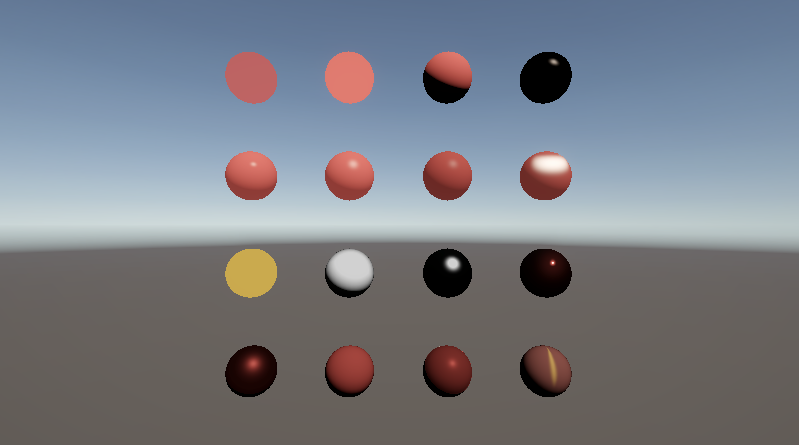

# はじめに
プログラムワークショップⅣの第3回の管理用です

# 結果画像

## 工夫した点
* Shader9,Shader16のFresnelをColor型に変更し、任意の色の反射光を出せるようにした
* PBRに異方性を実装し、ハイライトを縦横に伸ばせるようにした

# 進め方

- 本リポジトリ(tpu-game-2025/PGWS4_3)をforkしてください。
- fork先のリポジトリを更新してください
- Unityのプロジェクトをsrc内で進めて下さい。
- 結果を画面キャプチャして、画像としてリポジトリに追加して、上記のリンクから見れるようにしてください。
- 完成したら本リポジトリのmainブランチにpull requestを投げてください
